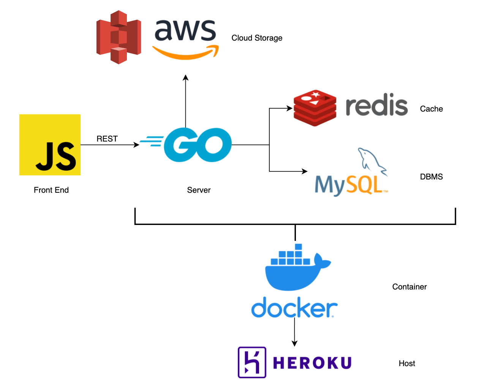

<h1 align = "center"> TIC2601 x Carouhell </h1>


[](https://github.com/aaronangxz/TIC2601/actions/workflows/build.yml) [](https://github.com/aaronangxz/TIC2601/actions/workflows/main.yml) 
    


<h2>Master Branch (Live)</h2>

- API endpoints are deployed on https://tic2601-t11.herokuapp.com
- Client is deployed on https://carouhell-tic2601.herokuapp.com/index.html
- Do not merge WIP features here, merge to test branch instead

<h2>Work Flow</h2>

1. Open [Issue](https://github.com/aaronangxz/TIC2601/issues) to specify feature type
2. `git pull` the latest commit from `test` branch
3. Work on the new feature and commit to a new branch `<name>/<feature#>/<description>`. [Example](https://github.com/aaronangxz/TIC2601/issues/89)
4. Create [Pull request](https://github.com/aaronangxz/TIC2601/pulls) to `test`
5. Once feature is done, test locally and ensure main flow is ok.
6. `git merge origin/test` to retrieve all latest changes in `test` branch.
7. Ensure `Build` check (automatically run for every commit in PR) is ok.
8. If everything is ok, merge into `test` and add this feature into the next [Release](https://github.com/aaronangxz/TIC2601/pull/137).
9. Locally test the `test` branch and ensure everything is ok.
10. Merge `test` into `master`, CI/CD will automatically deploy to live.

<h1>Architecture</h1>

<p align="center">

</p>

<h1>Local Testing</h1>

<h2>Build using DockerFile</h2>

1. Write `Dockerfile`
2. To build: `docker build --tag tic2601 .` (single dockerfile) / `docker build -f Dockerfile.server .` (multi dockerfiles)
3. Tag docker image `docker tag <imageid> tic2601:<version>`
4. `docker run tic2601` will run container isolated from network.
5. Use `docker run --publish 8080:8080 tic2601` to expose container to network and port. ([host_port]:[container_port])

<h2>Build using DockerCompose</h2>

1. Write `docker-compose.yaml`
2. To build: `docker-compsoe build`
3. To run `docker-compose up`

<h1>Credentials</h1>

Credentials are not pushed in the repo for obvious reasons. To properly run the server, prepare:

1. Heroku account with heroku registry activated
2. Install [ClearDB MySQL](https://elements.heroku.com/addons/cleardb) and [Redis Enterprise Cloud](https://elements.heroku.com/addons/rediscloud) add-ons and get the credentials in `ConfigVars`
3. Retrieve your AWS API KEY (For S3), bucket name, region
3. Create your own `.env` file in the `/GoServer` root
4. Save all credentials inside
5. All `os.GetEnv()` calls should work properly and all dependencies should work.

Template:
```go
//* = your values
//S3
AWS_ACCESS_KEY = *
AWS_SECRET_KEY = *
AWS_S3_REGION = *
S3_BUCKET = *

//MySQL
DB_NAME = *
DB_PASSWORD = *
DB_USERNAME = *
DB_URL = *

//Redis
REDIS_URL = *
REDIS_PORT = *
REDIS_PASSWORD = *

//Toggle CreateAccount to use Stored Procedure
USE_STORED_PROCEDURE = TRUE

//Toggle AddListingComment to check spam
CONFIG_ANTISPAM = TRUE

//Set in Heroku ConfigVars, change logging time zone
TZ = Asia/Singapore
```


<h1>Deployment</h1>

<h2>CI/CD</h2>

1. CI/CD has been set up for this repo: [WorkFlows](https://github.com/aaronangxz/TIC2601/actions)
2. The following changes will trigger the Deployment pipeline:
- Push / Merge pull requests to `master` branch
3. The following changes will trigger the Build pipeline:
- Push / Create pull requests to `test` branch

<h2>Manual Deployment</h2>

1. Follow steps above to build Docker imgage.
2. Login via `heroku container:login`
3. Tag image with Heroku registry link `docker tag <imageid> registry.heroku.com/tic2601-t11/web`
4. Push the tagged image `docker push registry.heroku.com/tic2601-t11/web`
5. Release image `heroku container:release web -a tic2601-t11`

<h1>Database Commands</h1>

1. Access within docker container:
    - `docker exec -it tic2601-db bash`
    - `mysql -u root -p`
2. Check user permission:
    - `show grants for <username>`
3. Give permission:
    - `GRANT ALL PRIVILEGES ON <Table Name> .* TO 'username'@'%'`
4. Check create query:
    - `SHOW CREATE TABLE <db name>.<table name>`

<h1>Test API endpoints</h1>

Postman Workspace: https://www.postman.com/science-specialist-94927587/workspace/tic2601

<h1>Test Branch</h1>

Refer to https://github.com/aaronangxz/TIC2601/tree/test